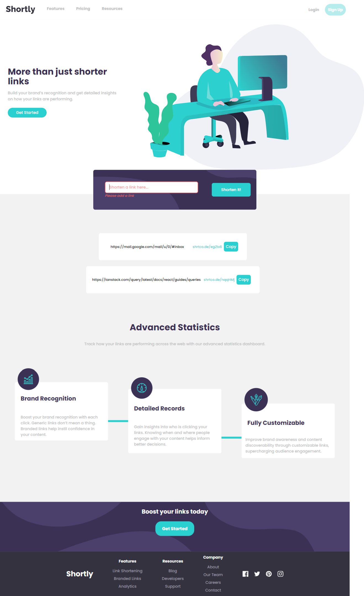

# Frontend Mentor - Shortly URL shortening API Challenge solution

This is a solution to the [Shortly URL shortening API Challenge challenge on Frontend Mentor](https://www.frontendmentor.io/challenges/url-shortening-api-landing-page-2ce3ob-G). Frontend Mentor challenges help you improve your coding skills by building realistic projects. 

## Table of contents

- [Overview](#overview)
  - [The challenge](#the-challenge)
  - [Screenshot](#screenshot)
  - [Links](#links)
- [My process](#my-process)
  - [Built with](#built-with)
  - [What I learned](#what-i-learned)
  - [Continued development](#continued-development)
  - [Useful resources](#useful-resources)
- [Author](#author)
- [Acknowledgments](#acknowledgments)


## Overview

This is a landing page for a company called Shortly that provides a URL shortening API. The page is fully responsive and built with React. The page is styled with Tailwind. The page is deployed on Netlify.

### The challenge

Users should be able to:

- View the optimal layout for the site depending on their device's screen size
- Shorten any valid URL
- See a list of their shortened links, even after refreshing the browser
- Copy the shortened link to their clipboard in a single click
- Receive an error message when the `form` is submitted if:
  - The `input` field is empty

### Screenshot

#### Desktop



#### Mobile


### Links

- Solution URL: [Add solution URL here](https://github.com/botirk38/url-shortening-api-master)
- Live Site URL: [Add live site URL here](https://shortly-url-botir.netlify.app/)

## My process

### Built with

- Semantic HTML5 markup
- CSS custom properties
- Flexbox
- CSS Grid
- Mobile-first workflow
- [React](https://reactjs.org/) - JS library
- [Vite] (https://vitejs.dev/) - For bundling
- [React-Query] (https://react-query.tanstack.com/) - For fetching data
- [Tailwind](https://tailwindcss.com/) - For styles
- [React-Hook-Form] (https://react-hook-form.com/) - For form validation

**Note: These are just examples. Delete this note and replace the list above with your own choices**

### What I learned

I learned how to use React-Query to fetch data from an API. 

```js
import { useQuery } from '@tanstack/react-query';

function useShortenLink(longLink) {
  return useQuery(
    ['linkData', longLink],
    () => fetch('/.netlify/functions/shortenLink', {
      method: 'POST',
      headers: {
        'Content-Type': 'application/json',
      },
      body: JSON.stringify({ url: longLink }),
    }).then((res) => res.json()),
    {
      enabled: !!longLink, // only run the query if longLink is defined
      staleTime: Infinity, // prevent automatic refetching when the data is stale
      cacheTime: Infinity, // keep the data in the cache indefinitely
    }
  );
}

export default useShortenLink;
```

### Continued development

 I want to improve the styling of the page and refine it a bit further, but since I am on some time constraints due to other obligations, I wasn't able to do so at this point.

### Useful resources

- [Tailwind Docs](https://tailwindcss.com/docs/installation) - It's always nice searching up the tailwind docs because its so easy to use and find what you need
- [Tanstack React Query Docs](https://tanstack.com/query/latest/docs/react/overview) - My first time using React Query so this was very nice to go through and learn how to use it


## Author

- Website - [Botir Khaltaev](https://portfolio-app-botir.netlify.app/)
- Frontend Mentor - [@botirk38](https://www.frontendmentor.io/profile/botirk38)


